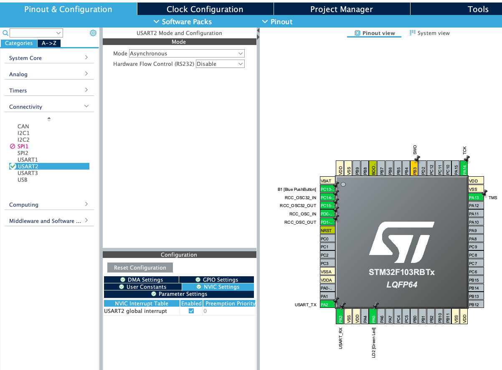

## ENSE 452 - Embedded and Real-Time Software Systems - Laboratory

# Lab 3: Command Line Interface Part 2

### University of Regina
### Faculty of Engineering and Applied Science - Software Systems Engineering

### Lab Instructor: [Trevor Douglas](mailto:trevor.douglas@uregina.ca)

## Objective

The objective here is to improve our Command-Line Interface (CLI) through which you can communicate with your target board. You will abandon the blocking methods used in USART communications and use interrupts. Of course at each step of the development, we will be paying attention to good software design principles.

## Background

ANSI escape sequences are a standard for in-band signalling to control cursor location, color, font styling, and other options on video text terminals and terminal emulators. Certain sequences of bytes, most starting with an ASCII Escape and bracket character followed by parameters, are embedded into text. The terminal interprets these sequences as commands, rather than text to display verbatim. In order to give these sequences you must give the escape sequence:
**\x1b[**  or 0x1B and 0x5B

For example to clear the screen, send the following escape sequence:
**\x1b[2J**

In order to position the cursor use this escape sequence:
**\x1b[0;0H**

Another good one for this lab is to create a scroll window:
**\x1b[10;r**

## Procedure
- Create a new Lab3 subdirectory inside your repository on your local machine.
- Start the STM32CubeIDE software and create a new STM32 project.
- Search and Select our Nucleo-64 board.
- Initiate all peripherals with their default mode.
- Enable the USART2 global interrupt.

<table>
  <tr>
    <td> </td>
  </tr>
</table>

- Save the project and generate all the setup code.

### Use the non-blocking transmit and receive functions

#### Transmit

HAL_StatusTypeDef HAL_UART_Transmit_IT(UART_HandleTypeDef *huart, <error-type> *pData, <error-type> Size)
Sends an amount of data in non blocking mode.

Parameters:
huart – Pointer to a UART_HandleTypeDef structure that contains the configuration information for the specified UART module.
pData – Pointer to data buffer (u8 or u16 data elements).
Size – Amount of data elements (u8 or u16) to be sent

Return values:
HAL status


ex:

// wait until uart is ready for transmit
while((HAL_UART_GetState(&huart2)&HAL_UART_STATE_BUSY_TX)==HAL_UART_STATE_BUSY_TX);
// transmit the buffer
HAL_UART_Transmit_IT(&huart2,(uint8_t*) buffer, len);

#### Receive

HAL_StatusTypeDef HAL_UART_Receive_IT(UART_HandleTypeDef *huart, <error-type> *pData, <error-type> Size)
Receives an amount of data in non blocking mode.

Parameters:
huart – Pointer to a UART_HandleTypeDef structure that contains the configuration information for the specified UART module.
pData – Pointer to data buffer (u8 or u16 data elements).
Size – Amount of data elements (u8 or u16) to be received.

Return values:
HAL status

ex:
<details>

```C
// wait until status is ok
while((HAL_UART_GetState(&huart2)&HAL_UART_STATE_BUSY_RX)==HAL_UART_STATE_BUSY_RX); 
//Listen for the interrupt and buffer one character at a time.
HAL_UART_Receive_IT(&huart2,(uint8_t*)RXBuffer,1);

```
</details>


//The callback or Interrupt Service Routine

<details>

```C
/**
  * @brief process a receiving character from USART
  *        The goal is to keep the function as fast as possible and to delegate the slow tasks like transmission
  *        to the main to increase the availability of the function to serve the next interrupt
  * @param huart:  handler to USART2 ( the only used one - no need to check)
  * @retval None
  * @note : RXBuffer[0]: Received character in
  *	      : TXBuffer   : the pattern to be sent responding to the received character
  *	      : TXlen 	   : contains the pattern length
  *	      : commandExec: flag to indicate that a command is ready to be processed
  *	      : readagain  : flag to tell the main memory to recall the non-blocking USART receiving function again
  */
void HAL_UART_RxCpltCallback(UART_HandleTypeDef *huart)
{


}

```
</details>


### Create the new CLI interface
Using the information in the videos and handout, create a CLI that has a status window that displays the status information for the board. It is up to you how you want to provide that information to the user but of course the cleaner and more concise the better. The command scroll window should appear below this window and provide a command prompt for the user to submit requests. This status window should be periodically updated using a timer feature. If a command comes in it should be acted on and the status window updated immediately.

### Tagging
In the lab I demonstrated tagging. There is also some references in URCourses. Please tag your assignment as Lab3Submission. Make sure this gets pushes to the remote.

## What To Submit
Nothing! Just make sure to use your repository accordingly.
