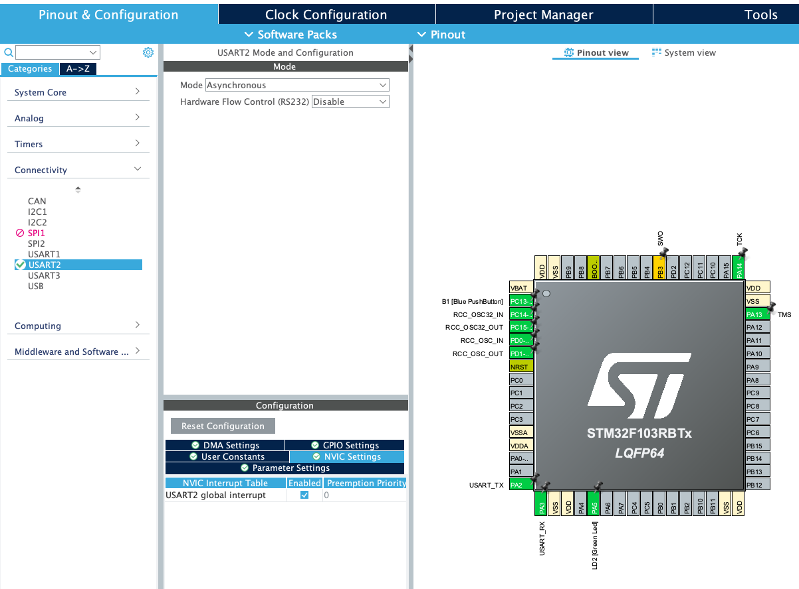

<!-- _class: lead -->

# ENSE 452
## Embedded and Real-Time Software Systems - Laboratory 3: More Command Line Interface

👨‍💻 SSE Lab Instructor: [Trevor Douglas](mailto:trevor.douglas@uregina.ca)

---
## Objective

The objective here is to improve our Command-Line Interface (CLI) through which you can communicate with your target board. You will abandon the blocking methods used in USART communications and use interrupts. Of course at each step of the development, we will be paying attention to good software design principles.

---
## What are ANSI escape sequences?
ANSI escape sequences are **in-band terminal commands** embedded in ordinary text.

The terminal interprets them as instructions instead of displaying them verbatim.

They can control:

- Foreground and background colors
- Bold, underline, inverse, and other styles
- Cursor position and movement
- Erasing parts of the screen
- Saving and restoring terminal state

---
## The essential prefix

Most sequences in this tutorial begin with the **Control Sequence Introducer**, or CSI:

```text
ESC [
```

As bytes:

```text
0x1B 0x5B
```

Inside a C string literal:

```c
"\x1b["
```

`\x1b` encodes the Escape byte. The following `[` is an ordinary bracket.

---

## How to implement?
ANSI escape sequences are a standard for in-band signalling to control cursor location, color, font styling, and other options on video text terminals and terminal emulators. Certain sequences of bytes, most starting with an ASCII Escape and bracket character followed by parameters, are embedded into text. The terminal interprets these sequences as commands, rather than text to display verbatim. In order to give these sequences you must give the escape sequence:

```text
\x1b[  or 0x1B and 0x5B
```

For example to clear the screen, send the following escape sequence:

```text
\x1b[2J
```

---
## More escape sequences
In order to position the cursor use this escape sequence:
```text
\x1b[0;0H
```

Another good one for this lab is to create a scroll window:
```text
\x1b[10;r
```

---
## First color program in C

```c
#include <stdio.h>

int main(void) {
    printf("Normal text\n");
    printf("\x1b[31mRed text\x1b[0m\n");
    printf("\x1b[32mGreen text\x1b[0m\n");
    printf("\x1b[1;34mBold blue text\x1b[0m\n");
    return 0;
}
```

Compile and run:

---
## USART Interrupt

<table>
  <tr>
    <td> </td>
  </tr>
</table>

---
## Receive
```C
HAL_StatusTypeDef HAL_UART_Receive_IT(UART_HandleTypeDef *huart, <error-type> *pData, <error-type> Size)
```

Receives an amount of data in non blocking mode.

Parameters:
huart – Pointer to a UART_HandleTypeDef structure that contains the configuration information for the specified UART module.
pData – Pointer to data buffer (u8 or u16 data elements).
Size – Amount of data elements (u8 or u16) to be received.

Return values:
HAL status

---
## Receive example

```C
// wait until status is ok
while((HAL_UART_GetState(&huart2)&HAL_UART_STATE_BUSY_RX)==HAL_UART_STATE_BUSY_RX); 
//Listen for the interrupt and buffer one character at a time.
HAL_UART_Receive_IT(&huart2,(uint8_t*)RXBuffer,1);

```
---
The callback or Interrupt Service Routine

```C
/**
  * @brief process a receiving character from USART
  *        The goal is to keep the function as fast as possible and to delegate the slow tasks like transmission
  *        to the main to increase the availability of the function to serve the next interrupt
  * @param huart:  handler to USART2 ( the only used one - no need to check)
  * @retval None
  */
void HAL_UART_RxCpltCallback(UART_HandleTypeDef *huart)
{


}

```

